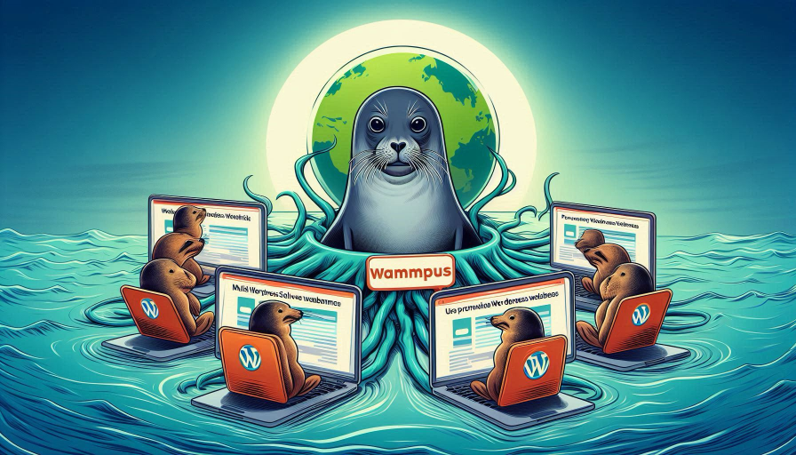

<!-- Improved compatibility of back to top link: See: https://github.com/othneildrew/Best-README-Template/pull/73 -->

<!--
*** Thanks for checking out the Best-README-Template. If you have a suggestion
*** that would make this better, please fork the repo and create a pull request
*** or simply open an issue with the tag "enhancement".
*** Don't forget to give the project a star!
*** Thanks again! Now go create something AMAZING! :D
-->

<!-- PROJECT SHIELDS -->
<!--
*** I'm using markdown "reference style" links for readability.
*** Reference links are enclosed in brackets [ ] instead of parentheses ( ).
*** See the bottom of this document for the declaration of the reference variables
*** for contributors-url, forks-url, etc. This is an optional, concise syntax you may use.
*** https://www.markdownguide.org/basic-syntax/#reference-style-links
-->
[![Contributors][contributors-shield]][contributors-url]
[![Forks][forks-shield]][forks-url]
[![Stargazers][stars-shield]][stars-url]
[![Issues][issues-shield]][issues-url]
[![MIT License][license-shield]][license-url]
[![LinkedIn][linkedin-shield]][linkedin-url]

<!-- PROJECT LOGO -->
 

  

<h3 align="center">dual-wordpress-phpmyadmin-podman</h3>

  

    This project demonstrates using Podman to provision two stand-alone SSL-secured WordPress websites with different root domains on a single server.  Both websites will be backed by individual Oracle MySQL databases and phpMyAdmin interfaces.
     
    <a href="https://slip.unreeled.com/2025/04/18/use-podman-to-provision-multiple-wordpress-websites-on-a-single-server//"><strong>Explore the docs »</strong></a>
     
<a href="https://github.com/slippman/dual-wordpress-phpmyadmin-podman/issues/new?labels=bug&template=bug-report---.md">Report Bug</a>
    ·
    <a href="https://github.com/slippman/dual-wordpress-phpmyadmin-podman/issues/new?labels=enhancement&template=feature-request---.md">Request Feature</a>
  

<!-- GETTING STARTED -->
## Getting Started
Please take a look at <a href="https://slip.unreeled.com/2025/04/18/use-podman-to-provision-multiple-wordpress-websites-on-a-single-server/">this blog post</a> for comprehensive usage details. 

In the future, I'll probably add more detail to this `README` file. In the mean time, feel free to <a href="#Contributing">contribute </a> any updates that you think would benefit the project to the `README` or codebase! 

### Built With

* [![Wordpress][wordpress]][wordpress-url]
* [![MySql][mysql]][mysql-url]
* [![phpMyAdmin][phpmyadmin]][phpmyadmin-url]
* [![Podman][podman]][podman-url]

<!-- CONTRIBUTING -->

## Contributing

This project is a work in progress. Any contributions you make are **greatly appreciated**. If you have a suggestion to improve the code, please fork the repo and create a pull request. 

You can also open an issue with the tag "enhancement." I have a few of my own that I will be adding soon!

Don't forget to give the project a star! Thanks again!

<!-- LICENSE -->
## License
Distributed under the GPL-3.0 license. See `LICENSE` for more information.

<!-- CONTACT -->
## Contact
Created by: Seth Lippman ([seth@unreled.com](mailto:seth@unreeled.com)) 
Check out some of my other projects - [where melodies meet algorithms.](https://slip.unreeled.com)

(<a href="#readme-top">back to top</a>)

<!-- MARKDOWN LINKS & IMAGES -->
<!-- https://www.markdownguide.org/basic-syntax/#reference-style-links -->
[contributors-shield]: https://img.shields.io/github/contributors/slippman/dual-wordpress-phpmyadmin-podman.svg?style=for-the-badge
[contributors-url]: https://github.com/slippman/dual-wordpress-phpmyadmin-podman/graphs/contributors
[forks-shield]: https://img.shields.io/github/forks/slippman/dual-wordpress-phpmyadmin-podman.svg?style=for-the-badge
[forks-url]: https://github.com/slippman/dual-wordpress-phpmyadmin-podman/network/members
[stars-shield]: https://img.shields.io/github/stars/slippman/dual-wordpress-phpmyadmin-podman.svg?style=for-the-badge
[stars-url]: https://github.com/slippman/dual-wordpress-phpmyadmin-podman/stargazers
[issues-shield]: https://img.shields.io/github/issues/slippman/dual-wordpress-phpmyadmin-podman.svg?style=for-the-badge
[issues-url]: https://github.com/slippman/dual-wordpress-phpmyadmin-podman/issues
[license-shield]: https://img.shields.io/github/license/slippman/dual-wordpress-phpmyadmin-podman.svg?style=for-the-badge
[license-url]: https://github.com/slippman/dual-wordpress-phpmyadmin-podman/blob/master/LICENSE
[linkedin-shield]: https://img.shields.io/badge/-LinkedIn-black.svg?style=for-the-badge&logo=linkedin&colorB=555
[linkedin-url]: https://linkedin.com/in/sethlippman
[product-screenshot]: images/screenshot.png
[mysql]: https://img.shields.io/badge/MySQL-white?style=for-the-badge&logo=MySQL&logoSize=auto&labelColor=E9EBF0&color=%234479A1&logoSize=100
[mysql-url]: https://mysql.com/
[wordpress]: https://img.shields.io/badge/wordpress-21759B?style=for-the-badge&logo=wordpress&logoColor=%2321759B&labelColor=E9EBF0&logoSize=100
[wordpress-url]: https://wordpress.com/
[phpmyadmin]: https://img.shields.io/badge/phpmyadmin-%236C78AF?style=for-the-badge&logo=phpmyadmin&logoColor=%236C78AF&labelColor=E9EBF0&logoSize=100
[phpmyadmin-url]: https://phpmyadmin.net/
[podman]: https://img.shields.io/badge/podman-%23892CA0?style=for-the-badge&logo=podman&logoColor=%23892CA0&labelColor=E9EBF0&logoSize=100
[podman-url]: https://podman.io/

